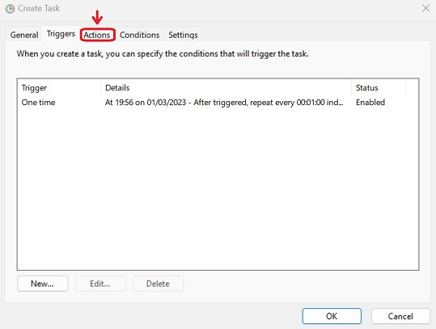
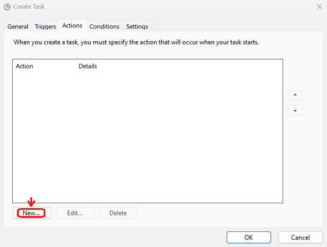
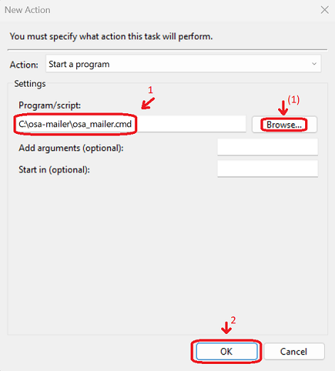
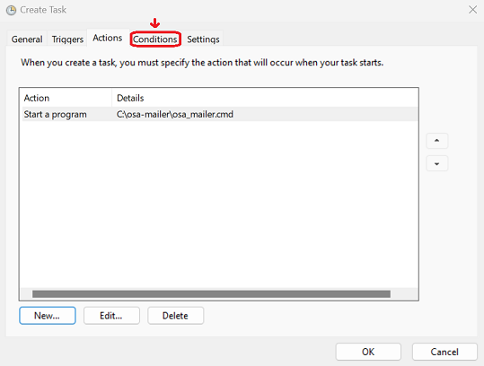
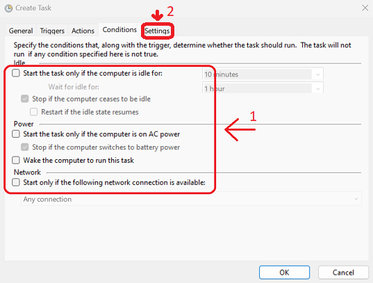
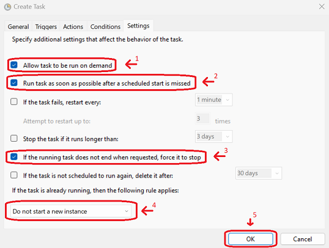

# Windows Setup

## Preface

At this stage of the development, there is no installer.

Currently the way to use _OSA-Mailer_ is it have an external system to run its run script `osa_mailer.cmd`

## Download

**Steps:**
1. Get to the [releases](https://github.com/DK26/osa-mailer/releases) page
2. Pick the latest version of _OSA-Mailer_
3. Expand the `Assets` title by clicking on it
4. Pick the `.7z` 7-zip archive file for Windows and click on it to start downloading

## Extract

In order to extract a 7-zip archive, you need an extractor that supports it. Your best bet is probably to download the official 7-zip from its website [https://www.7-zip.org/](https://www.7-zip.org/)

**Steps:**  

1. Extract the archived file from the `Download` section anywhere you like, but make sure you will have controlled access to the extracted `outbox` directory as this directory serves clients as a gateway for sending E-mails

## Configure

`osa_mailer.cmd` :

```batch
:: Configurations
SET SERVER=localhost
SET PORT=25
SET AUTH=noauth
::SET USERNAME=username
::SET PASSWORD=password
```

**Steps:**

1. Edit the script file `osa_mailer.cmd` with your favorite text editor
2. Look for the `:: Configurations` comment  
3. Notice the `SET` statements which set each environment variable for _OSA-Mailer_
4. Configure each _environment variable_ accordingly:  

   | Environment Variable | Description                                                                      | Mandatory |
   | -------------------- | -------------------------------------------------------------------------------- | --------- |
   | `SERVER`             | SMTP server IP address or hostname (e.g. Gmail, Outlook, SMTP relay-proxy, etc.) | ✅         |
   | `PORT`               | The TCP port number for the `SERVER` variable                                    | ✅         |
   | `AUTH`               | Authentication method: `TLS`, `STARTTLS` or `NOAUTH`                             | ✅         |
   | `USERNAME`           | Provides the username when using an authentication method other than `NOAUTH`    | ❌         |
   | `PASSWORD`           | Provides the password when using an authentication method other than `NOAUTH`    | ❌         |

- _To uncomment a variable, remove the double-colons `::` from its `SET` statement (e.g. `::SET USERNAME=username` becomes `SET USERNAME=username`)_

## Setup a Task for Windows Task Scheduler

Windows Task Scheduler can be used as a means to trigger and activate _OSA-Mailer_, but it is **not** a requirement in case it doesn't fit your use-case.

### Open the Windows Task Scheduler

Here are a few links to external articles on different methods to launch the Windows Task Schedular:
- [Windows 10](https://www.wikihow.com/Open-Task-Scheduler-in-Windows-10)
- [Windows 11](https://www.makeuseof.com/windows-11-open-task-scheduler/)
  
Here is one way to do this:  
In order to open the Windows Task Schedular, we will use a `Run` command:

1. Hold the `Windows` button + press the `R` button
2. This should open the `Run` window
3. Type in: `taskschd.msc` and either click the `OK` button or press the `ENTER` key

  

 

### Create a new Task

It is recommended to create the task within a dedicated folder so it will be easier to maintain and not mix-up with other unrelated tasks.


**Steps:**
1. On the left pane, select the `Task Scheduler Library` directory by clicking on it once with the `LEFT MOUSE BUTTON` 
2. Once selected, `RIGHT MOUSE BUTTON` click on the already selected `Task Scheduler Library`, to open the actions menu
3. Select `New Folder...` from the actions menu

   

4. Pick a proper name (`OSA-Mailer` is recommended) and either click on the `OK` button or press the `ENTER` key

   

5. Select the newly created folder by a single `LEFT MOUSE BUTTON` click
   
   

6. Once selected, `RIGHT MOUSE BUTTON` click on it again to pop the actions menu 
7. Select the `Create Task...` from the actions menu
   
   

8. The `Create Task` window will pop-up
9. Provide the name for the task: `Check Outbox` (recommended)
10. Under `Security options`, select the `Run whether user is logged on or not` and check the `Do not store password. The task will only have access to local computer resources.` checkbox
11. Click on the `Triggers` tab
   
   
    
12. On the `Triggers` tab, click on the `New...` button to create a new trigger
    
   

13. The `New Trigger` window will pop-up
14. Make sure that `Begin the task:` is set to `On a schedule`
15. Make sure that `Settings` is set on `One time`
16. Under `Advanced settings`, make sure that the `Repeat task every:` checkbox is checked
17. **(Recommended)**: Manually copy the value `1 minute` and assign it
18. Make sure that `for a duration of:` is set to `Indefinitely`
19. Make sure that the `Enabled` checkbox is checked
20. Click on the `OK` button to the add the trigger
    
   

21. Click on the `Actions` tab

   

22. On the `Actions` tab, click on the `New...` button to create a new action

   

23. The `New Action` window will pop-up
24. Under the `Program/script:`  textbox, assign the path to where the `osa_mailer.cmd` file is located
   - **Optional:** You can click on the `Browse...` button to locate the `osa_mailer.cmd` file
25. Click on the `OK` button to the add the action

   

26. Click on the `Conditions` tab

   

27. Make sure that there are no conditions in place and all checkboxes are unchecked
28. Click on the `Settings` tab

   

29. Make sure that only the following checkboxes are checked:
    1.  `Allow task to be run on demand`
    2.  `Run task as soon as possible after a scheduled start is missed`
    3.  `If the running task does not end when requested, force it to stop`
    4.  Make sure that the field `If the task is already running, then the following rule applies:` has the value `Do not start a new instance` in its dropbox
    5.  Make sure the rest of the checkboxes are unchecked
    6.  Click on the `OK` button to create the task

   

30. We are _finished_. You can close the Windows Task Scheduler
